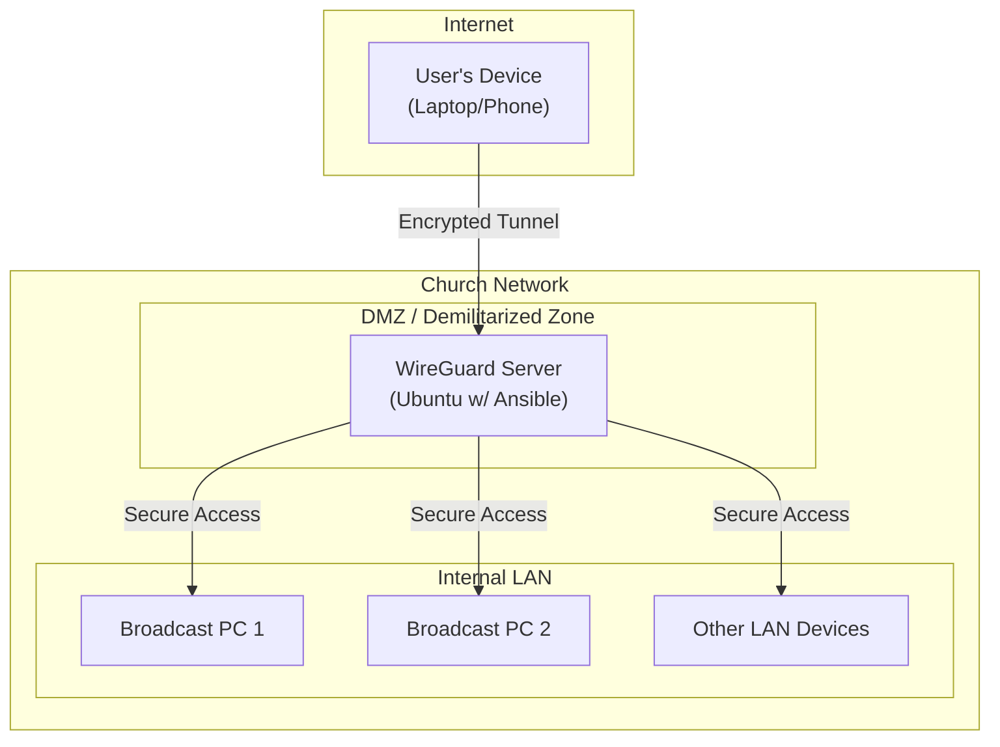
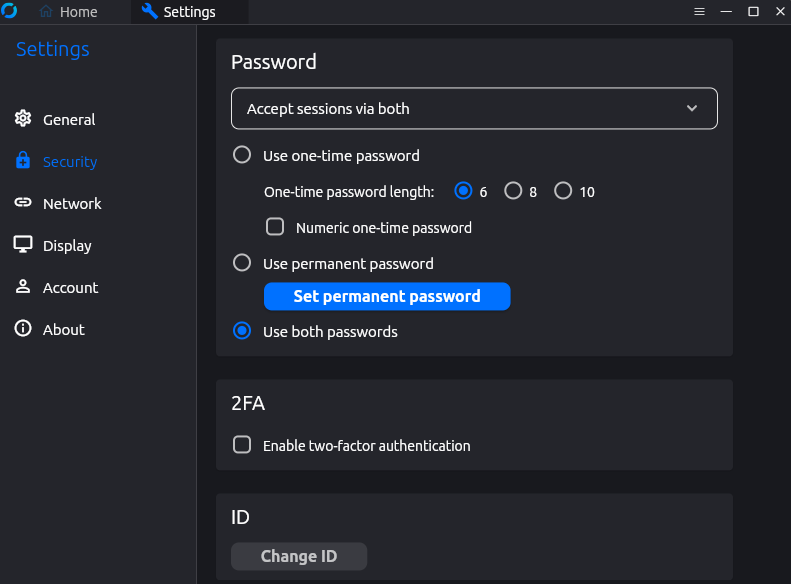
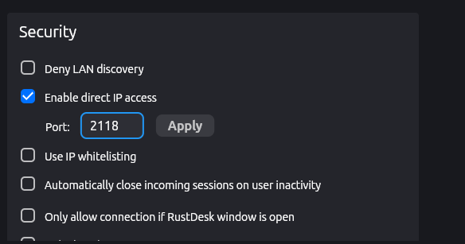
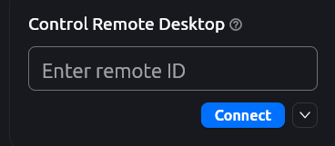

# Remote Access System for WCI Dundee

This project contains the Ansible playbooks to automatically configure the remote access infrastructure for the WCI Dundee technical team. It ensures that our team can prepare for services and resolve technical issues from anywhere, at any time.

The "why" is simple: to ensure that distance or delays never stop us from serving the congregation.

---

## 1. For the User: How to Connect to the Network

This is for team members who need to connect their devices to the church network.

### Step 1: Install the Tools
You need two applications on your computer:

1.  **WireGuard:** The app that creates the secure "tunnel" to the church network.
    *   [Download from the official site](https://www.wireguard.com/install/)
2.  **RustDesk:** The app that lets you control the church computers.
    *   [Download from the official site](https://rustdesk.com/)

### Step 2: Get Your Configuration File
Contact the technical administrator. They will provide you with a unique `[your_name].conf` file. This file is your personal key to the network. **Treat this file with the same security as a password, as it grants access to the church network. Do not share it.**

### Step 3: Connect
1.  Open the WireGuard app.
2.  Click **"Import tunnel(s) from file"** and select the `.conf` file you were given.
3.  Click the **"Activate"** button.

Once activated, you are securely connected to the church network. You can now open RustDesk and use the saved credentials to access the broadcast machines.

---

## 2. For the Administrator: How to Use These Playbooks

This section is for managing the infrastructure itself. These playbooks automate the setup of laptops and the WireGuard server.

### Step 1: Clone the Repository
First, get a copy of this project onto your administrative machine (or the server itself, if you're running the playbooks locally) by cloning the Git repository:

```bash
git clone https://github.com/Charcoaljam1/wcid-remote-access.git
cd wcid-remote-access
```
**Note:** The repository is located at `https://github.com/Charcoaljam1/wcid-remote-access.git`.

### Step 2: Prerequisites
Before you run these playbooks, make sure you have:
1.  **Ansible Installed:** If not, run `pip install ansible`.
2.  **SSH Access:** Ensure you have passwordless SSH access to the target machines (the server or laptops you are configuring).
3.  **Configured Inventory:** Edit the `inventory.ini` file to list the hosts you want to manage. For example:

    ```ini
    [wireguard_server]
    server_ip ansible_user=your_username
    ```
4.  **Set Variables:** Edit `vars.yml` to define user names, paths, and other configuration details for the playbooks.

### Managing Secrets with Ansible Vault

Sensitive information, such as the `duckdns_token`, is secured using Ansible Vault.
1.  **Create/Edit Vault:** To create a new vault file or edit an existing one (e.g., for `duckdns_token`), run:
    ```bash
    ansible-vault create group_vars/all/vault.yml   # To create a new vault file
    # OR
    ansible-vault edit group_vars/all/vault.yml     # To edit an existing vault file
    ```
    You will be prompted to create/enter a vault password. **Remember this password; it cannot be recovered if lost.**
2.  **Add Secrets:** Inside the vault file, add your sensitive variables (e.g., `duckdns_token: "your-real-token"`).
3.  **Remove from Plaintext:** Ensure no sensitive variables remain in unencrypted files like `group_vars/all.yml` or `roles/duckdns/vars/main.yml`.

### New to Ansible and Linux?
If you are new to server administration or Ansible, these resources provide a great starting point:
*   **Linux Basics:** [Learn Linux with this 5-day course from the Linux Foundation](https://www.youtube.com/watch?v=sWbUDq4S6Y8)
*   **Ansible Basics:** [Official Ansible "Getting Started" Guide](https://docs.ansible.com/ansible/latest/user_guide/getting_started.html)
*   **Ansible for Beginners Video:** [Ansible Full Course for Beginners by Jeff Geerling](https://www.youtube.com/watch?v=goclfp6a2dI)

### Managing VPN Users (Peers)

To add or remove users who can connect to the VPN:
1.  Edit `roles/wireguard/vars/main.yml`.
2.  Modify the `peers` list to add or remove entries (e.g., `- name: "NewUser"`).
3.  The playbook will automatically generate or update configuration files for these users.

### Available Playbooks

*   `site.yml`: This is the main playbook that orchestrates the configuration of the WireGuard server and DuckDNS client, and generates peer configurations.
    ```bash
    # Run this playbook. If you are using Ansible Vault, you MUST include --ask-vault-pass.
    # Replace 'localhost' with your target host or group as defined in inventory.ini if not running locally.
    ansible-playbook site.yml --ask-vault-pass
    ```
*   **Generated Peer Configurations:** After running the playbook, individual client configuration files (`.conf`) will be generated on your Ansible control machine in `~/wireguard/configs/`. These are the files you will distribute to users.
---

## 3. The "Why": Understanding The System (The Original README)

This section preserves the excellent, detailed explanation of why this system exists and how the underlying technology works. It is not required for day-to-day use but is invaluable for understanding the architecture and security principles.

<details>
<summary><b>Click to expand the full system explanation</b></summary>

### System Architecture Diagram
This diagram shows how a remote user connects securely to the church's internal network.



Quick Summary

| **Feature**             | **Benefit to the Church**                              |
| ----------------------- | ------------------------------------------------------ |
| **Remote Prep**         | Reduced Sunday morning stress and "rushed" mistakes.   |
| **Instant Fixes**       | Technical issues can be resolved in minutes from home. |
| **Bank-Level Security** | Church data is hidden and encrypted from the public.   |
| **Cost Savings**        | We own the hardware; no monthly software fees.         |

### Why do we need remote access?

> [!IMPORTANT] The Challenge
> *We identified a significant risk in our operations: if our team cannot get to the building, our church services cannot function properly; therefore, we built this system to ensure that distance or delays never stop us from serving the congregation.*

The current setup serves as the backbone of a new remote infrastructure that ensures our services remain uninterrupted, regardless of who is physically in the building. This system provides our department with the flexibility to troubleshoot issues instantly from anywhere, meaning a late arrival or an unexpected absence no longer puts the Sunday morning experience at risk. We have effectively moved away from a 'single point of failure' model to one that is resilient, modern, and highly dependable.

### How secure is this?
We protect the church’s data using two layers of security that act like a "Digital Vault":
- **The Secure Tunnel (Wireguard):** Think of this as a military-grade, invisible tunnel built underneath the public internet. Even though the data travels across the web, it is **fully encrypted** (scrambled). To anyone on the outside, it looks like gibberish. Only the church's server has the "decoder ring" to read it.
- **The Unique Key System:** Access isn't granted by a simple password that can be guessed. Each team member’s device has a **unique digital key**. If a device does not have its specific key registered on our HP server, the "tunnel" stays locked and invisible to them.

In short: We haven't just opened a door to the internet; we have built a private, invisible entrance that only our specific, pre-approved devices can find and unlock.

</details>

<details>
<summary><b>Click to expand the manual server setup guide (for emergencies)</b></summary>

This is the original manual setup guide. With Ansible, you should not need this, but it is preserved here for historical and educational purposes.

### Setting Up Rustdesk
1. Download Rustdesk for your device from [here](https://github.com/rustdesk/rustdesk/releases/tag/1.4.4)
2. Run the installation file on your computer
3. Launch the app
4. Click on the three dots beside the ID to access the settings page  
   
5. Click on the Security tab and then on the "Unlock Security Settings" button 
6. It will then request for authentication or admin permission 
7. Once you have been authenticated, scroll down to the password section and select "Use permanent password" 
8. Create a strong password
9. Finally scroll to the bottom of the Security tab and select "Enable direct IP access" 
10. Then set the port to 2118 and click Apply 
11. You can now remote into the desktop by entering the device's ID into the box 

### Remoting into the Dell desktop
1. Open Wireguard
2. Click on connect
3. Open the Rustdesk app
4. Type in the Dell's Remote ID or local IP address in the box below 
5. Click connect and input the password

### The System Architecture
- **Hardware:** Dell Inspiron Laptop (i3-11th Gen/8GB RAM)
- **The OS:** Linux (Ubuntu Server 24.04.3 LTS)

### The Blueprint
Install Wireguard on the server by running the script below
```bash
sudo apt update
sudo apt upgreade -y
sudo apt install wireguard
```
The Wireguard service is running on the machine's bare metal rather than being containerised in docker because it adds a lot more complexity to the setup than needed; it becomes a hassle if you want to ssh into the server. Also, in setting it up, the whole point of containerising a service becomes defeated because a lot of holes have to be poked into the container to allow it function properly and route data packets normally.

Once Wireguard has been installed, you will need to create a private and public key for the server alongside the key pairs for the peer devices using the `wg genkey` and `wg pubkey` commands.

You can create a directory to store the generated keys and run the following commands to create the key pairs for the server and its peers
```bash
mkdir -p ~/services/wireguard/config_files
cd ~/services/wireguard/config_files

wg genkey | tee server.key | wg pubkey > server.pub
```

The commands above can be repeated when creating the key pairs for the peer devices.
```bash
wg genkey | tee <peer_name>.key | wg pubkey > <peer_name>.pub
```

Once you have created the keys, you will need to create a configuration file in the /etc directory using the command below:
```bash
sudo nano /etc/wireguard/wg0.conf
sudo chmod 600 /etc/wireguard/wg0.conf # Make sure only root can read it, because it contains the private key!
```

 In the config file you will include the Interface's (server's) address, it's listening port and the private key. Alongside that, the public key and IP addresses of the peers (devices) that will be allowed to connect to the server will also be included in the config like so:
 ```txt
[Interface]
Address = 10.13.13.1/24
ListenPort = 51820
PrivateKey = <SERVER_PRIVATE_KEY>

# Route traffic for VPN clients
PostUp = iptables -A FORWARD -i wg0 -j ACCEPT; iptables -t nat -A POSTROUTING -o enp2s0 -j MASQUERADE
PostDown = iptables -D FORWARD -i wg0 -j ACCEPT; iptables -t nat -D POSTROUTING -o enp2s0 -j MASQUERADE

[Peer]
# John Smith's laptop
PublicKey = <PEER_PUBLIC_KEY>
AllowedIPs = 10.13.13.2/32
 ```
To start up Wireguard directly on the host, run:
```bash
sudo wg-quick up wg0
```

To make Wireguard start automatically when the server boots up, enable the systemd service:
```bash
sudo systemctl enable wg-quick@wg0
```

</details>
